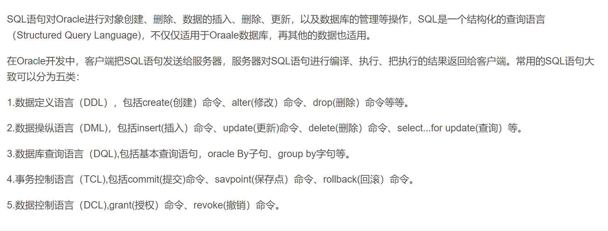
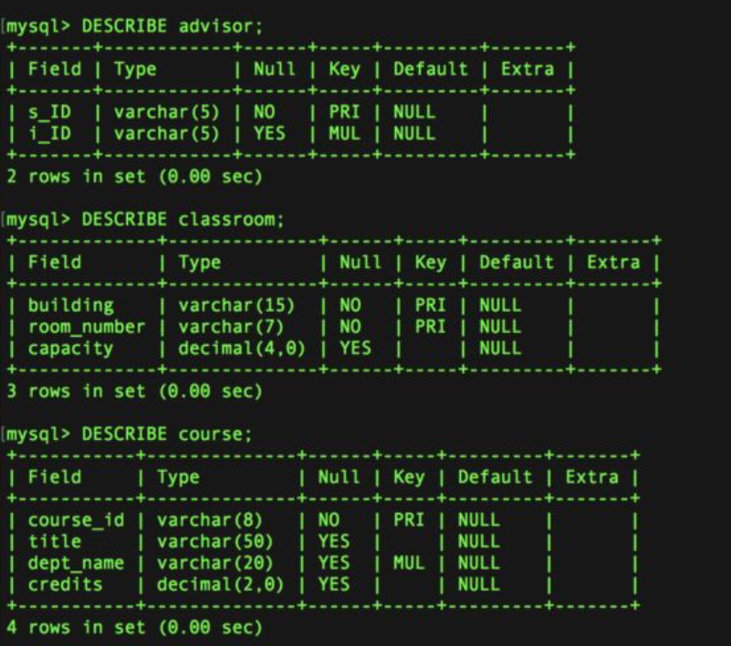

# SQL语句介绍



## 数据库
### 1.创建数据库
```SQL
CREATE DATABASE <数据库名>;
```
### 2.删除数据库
```SQL
DROP DATABASE <数据库名>;
```
### 3.查看现有数据库
```SQL
SHOW DATABASES;
```

## 表
### 1.查看当前数据库中的表
```SQL
SHOW TABLES;
```

### 2.创建新表
```SQL
CREATE TABLE <表名> (
    <列名1> <列类型1>,
    <列名2> <列类型2>,
    <列名3> <列类型3>,
    PRIMARY KEY (<列名1>),
    FOREIGN KEY (<列名2>) REFERENCES <表名2>(<列名2>)
);
```
>主键（PRIMARY KEY）用来标识一条记录（一行），所以每条记录的主键值必须是唯一的。主键可以定义在多列上，这称为**联合主键（composite primary key）**。

>如果我们把表视作具有某种结构的数组[（例如，C语言中的struct）](https://blog.csdn.net/weixin_43115440/article/details/93486050)，那么外键（FOREIGN KEY）可以视作指针。

<font color=red>*例子：*</font>
```SQL
CREATE TABLE instructor (
    ID CHAR(5),
    name VARCHAR(20) NOT NULL,
    dept_name VARCHAR(20),
    salary NUMERIC(8,2), 
    PRIMARY KEY (ID),
    FOREIGN KEY (dept_name) REFERENCES department(dept_name));
```
>在上面的例子中，我们创建了一个<font color=orange>教员（instructor）表</font>，该表的**主键**是<font color=orange >ID</font>，**外键**是教员所在的<font color=orange >部门名称（dept_name）</font>，**关联**<font color=orange >部门（department）表</font>。此外，教员表还包括<font color=orange >姓名（name）</font>、<font color=orange >薪水（salary）</font>。其中，姓名有约束<font color=orange >NOT NULL</font>，表示姓名这一项不能为空。


### 3.概述表中的列
```SQL
DESCRIBE <表名>;
```
<font color=red>*例子：*</font>



### 4.在表中插入新纪录
```SQL
INSERT INTO <表名> (<列名1>, <列名2> …)
    VALUES (<值1>, <值2>, <值3>, …);
```
**也可以省略列名（依序在所有列上插入新值）：**
```SQL
INSERT INTO <表名>
    VALUES (<值1>, <值2>, <值3>, …);
```

### 5.在表中更新记录
```SQL
UPDATE <表名>
    SET <列名1> = <值1>, <列名2> = <值2>, ...
    WHERE <条件>;
```
### 6.清空表
```SQL
DELETE FROM <表名>;
```
### 7.删除表
```SQL
DROP TABLE <表名>;
```
## 查询
### 1.SELECT
```SQL
SELECT <列名1>, <列名2>, …
    FROM <表名>;
```
**以下语句选择所有内容：**
```SQL
SELECT * FROM <表名>;
```
<font color=green>未完待续……</font>

